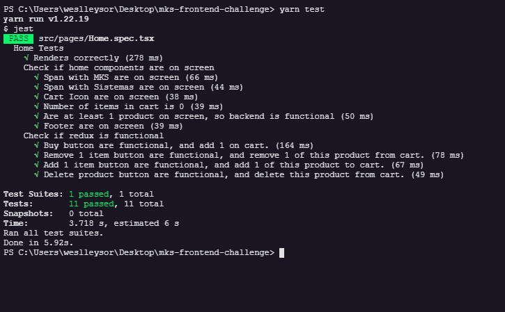

###### Informações:

- Aplicação responsiva, feita em mobile first.
- Usei como base as dimensões Mobile P, 320x702.
- Hospedado na vercel: [Link do projeto](https://mks-frontend-challenge-weslleysor.vercel.app/)

###### Versões utilizadas:

- Node: v16.17.0
- Yarn: 1.22.19

###### Considerações:
- Foi pedido para utilizar skeleton enquanto estiver em loading, porém o getStaticProps do Nextjs descarta essa opção, pois ele só carrega a página depois que a requisição for feita, logo o skeleton nunca apareceria na página.

---

###### Como iniciar o projeto:

- Navegue até a pasta do projeto.

- Instale as dependencias do **projeto** utilizando o comando: `yarn`

- Para iniciar o projeto, utilize o comando `yarn dev`

- Por padrão o projeto fica hospedado em `http://localhost:3000/`

###### Realização de testes unitários:

- Após a instalação das dependencias do projeto com o `yarn`, utilizar o comando: `yarn test`
- 

  
Screenshot mostrando os testes

  

